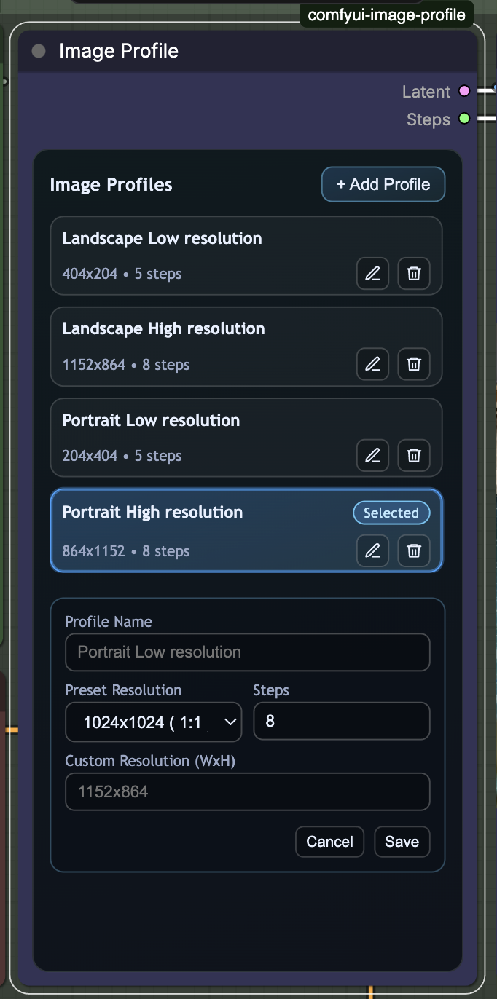

# ComfyUI Image Profile Node

Small ComfyUI custom node for managing reusable image generation profiles (resolution + steps) directly inside one node UI.



## Node

- **Image Profile**
  - No visible input connectors
  - Outputs:
    - `Latent` (`LATENT`)
    - `Steps` (`INT`)
  - Category: `Latent/Profile`
  - Profile actions:
    - Create, edit, duplicate, delete
    - Drag-and-drop reorder
    - Select active profile
  - Includes resolution presets plus custom `WxH` input

## Default profiles

New nodes start with:

- `Landscape Low resolution` -> `404x204`, `5` steps
- `Portrait Low resolution` -> `204x404`, `5` steps
- `Landscape High resolution` -> `1152x864`, `8` steps
- `Portrait High resolution` -> `864x1152`, `8` steps

## Quick start

1. Put this folder in `ComfyUI/custom_nodes/comfyui-image-profile`
2. Restart ComfyUI
3. Add node `Image Profile` from category `Latent/Profile`

## Validation and behavior

- Resolution is normalized to nearest multiple of `8`, clamped to `[8, 16384]`
- Steps must be integer and are clamped to `[1, 150]`
- Duplicate names are auto-suffixed (`Name (2)`, `Name (3)`, ...)
- Last profile cannot be deleted
- Batch size is fixed to `1`

## Persistence

Profiles are stored per node instance in hidden widgets and serialized in workflow JSON.

`profiles_json` schema:

```json
[
  {
    "id": "uuid-or-stable-id",
    "name": "Portrait Low resolution",
    "width": 864,
    "height": 1152,
    "steps": 8
  }
]
```

Mirrored selected values:

- `selected_profile_id`
- `selected_width`
- `selected_height`
- `selected_steps`

## Notes

- This is a node-local profile manager, not a global shared profile library.
- UI state and profile ordering persist when saving/loading workflow JSON.

## References

- [ComfyUI LMStudio Nodes (related project)](https://github.com/glonlas/comfyUI-LMStudio-nodes)
- [ComfyUI custom node docs](https://docs.comfy.org/development/core-concepts/custom-nodes)
